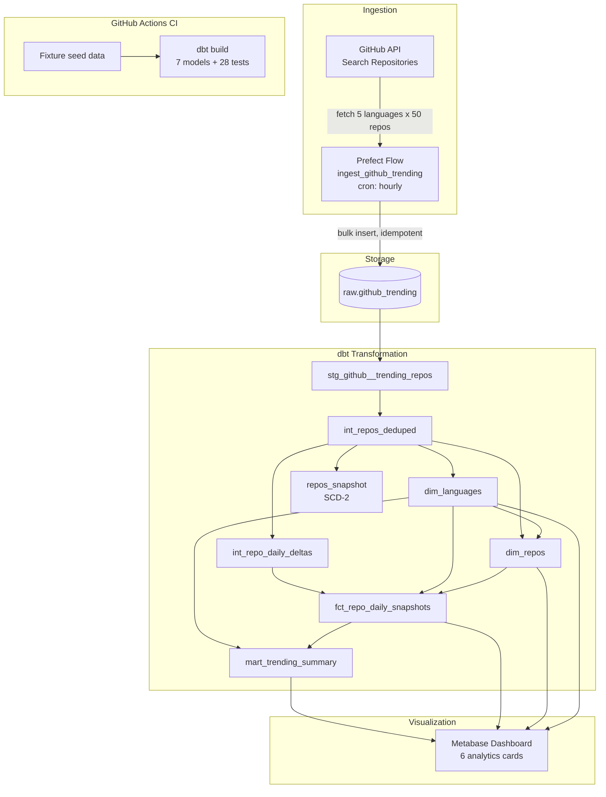
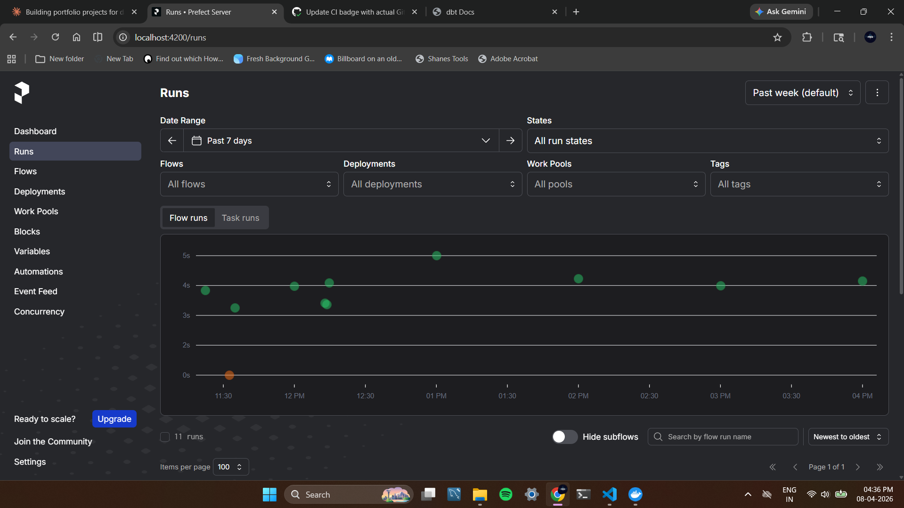
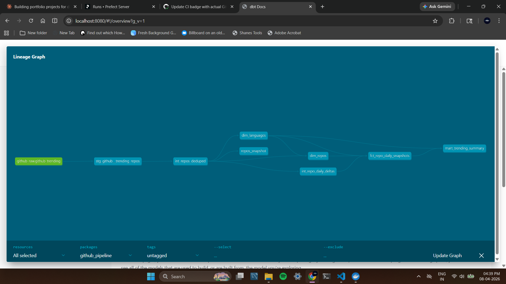
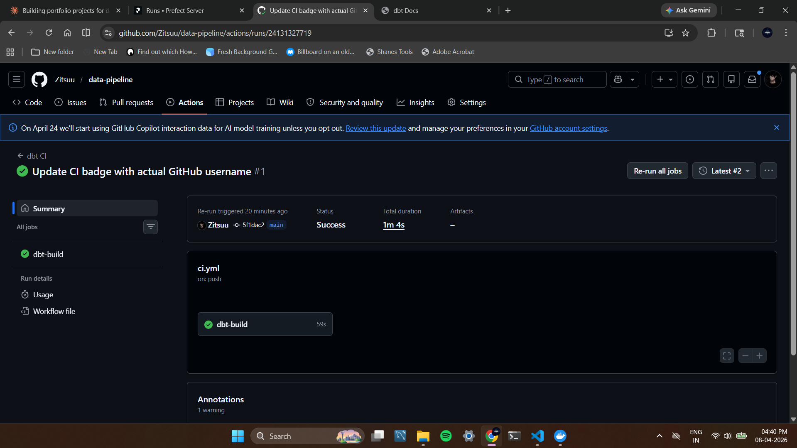

# Data Pipeline — GitHub Trending Repos


An end-to-end data pipeline that ingests trending GitHub repositories every hour, transforms them through a dbt star schema, and serves analytics to a Metabase dashboard. Fully containerized with Docker, orchestrated by Prefect, and protected by GitHub Actions CI that runs the entire dbt test suite on every push.

`Python` `Prefect` `PostgreSQL` `dbt` `Metabase` `Docker` `GitHub Actions`

## Architecture Diagram



## Key Features

- **Hourly ingestion** — Prefect flow fetches 250 trending repos (5 languages x 50) from the GitHub Search API on an hourly cron schedule
- **Idempotent loads** — `INSERT ... ON CONFLICT DO NOTHING` ensures re-runs never create duplicates
- **Star schema** — dimensional model with fact table, repo/language dimensions, and a pre-aggregated summary mart
- **28 dbt tests** — uniqueness, not-null, referential integrity, accepted values, and expression checks across all layers
- **SCD-2 snapshots** — dbt snapshot tracks how stars, forks, and descriptions change over time
- **Interactive dashboard** — 6 Metabase cards: top repos, fastest growing, language trends, and more
- **CI on every push** — GitHub Actions spins up a fresh Postgres, seeds fixture data, and runs the full `dbt build`
- **Fully Dockerized** — `docker compose up -d` starts Postgres, Prefect, and Metabase in seconds

## Dashboard

Metabase runs at **http://localhost:3000**. See [dashboards/SETUP.md](dashboards/SETUP.md) for a click-by-click setup guide.

| Card | Description | Visualization |
|------|-------------|---------------|
| Top 10 Trending Repos | Highest-starred repos across all languages | Table |
| Fastest Growing Repos | Repos with largest day-over-day star gains | Table |
| Language Popularity Over Time | Total stars per language by date | Line chart |
| Average Stars by Language | Current-day average stars per language | Bar chart |
| Total Repos by Language | Distribution of tracked repos | Pie chart |
| Recently Active Repos | Repos pushed within the last 7 days | Table |

All SQL queries are in [dashboards/queries.sql](dashboards/queries.sql).


## Setup

```bash
# 1. Start infrastructure
docker compose up -d

# 2. Create venv and install dependencies
python -m venv venv
source venv/Scripts/activate   # Windows
pip install -r requirements.txt

# 3. Run the ingestion flow
python -m flows.ingest_github

# 4. Build dbt models
cd dbt_project && dbt deps && dbt run && dbt snapshot && dbt test && cd ..

# 5. Run smoke tests
pytest tests/ -v

# 6. Open Metabase at http://localhost:3000 and follow dashboards/SETUP.md
```

## Data Sources

**GitHub Search API** — fetches trending repositories created in the last 7 days, sorted by stars, across Python, TypeScript, Rust, Go, and JavaScript.

- Unauthenticated: 10 requests/minute, 60 requests/hour
- Authenticated (set `GITHUB_TOKEN` in `.env`): 30 requests/minute, 5,000 requests/hour

## Orchestration

The ingestion flow runs as a **Prefect deployment** (`github-trending-hourly`) against the Prefect server in Docker.

- **Schedule:** Every hour (`0 * * * *`, Asia/Kolkata)
- **Work pool:** `default-pool` (process type)
- **Per run:** 5 languages x 50 repos = up to 250 rows

```bash
# Start the worker (dedicated terminal)
prefect worker start --pool default-pool

# Trigger a manual run
prefect deployment run "ingest-github-trending/github-trending-hourly"
```

Monitor at http://localhost:4200.



> **Note:** For production, the worker would be a systemd/Windows service or a containerized worker. For this portfolio project, the manual terminal approach is sufficient.

## Data Modeling

dbt transforms raw data through three layers:

| Layer            | Schema         | Materialization | Purpose                                  |
|------------------|----------------|-----------------|------------------------------------------|
| **staging**      | `staging`      | view            | Clean, cast, rename, derive basic fields |
| **intermediate** | `intermediate` | view            | Deduplicate, compute day-over-day deltas |
| **marts**        | `analytics`    | table           | Star schema for dashboards and BI        |

### Star Schema

```
raw.github_trending
  └─► stg_github__trending_repos       (staging view)
        └─► int_repos_deduped          (1 row per repo per day)
              ├─► int_repo_daily_deltas (+ star/fork/issue deltas)
              │     └─► fct_repo_daily_snapshots  (fact table)
              │           └─► mart_trending_summary   (pre-aggregated)
              ├─► dim_repos             (repo dimension)
              ├─► dim_languages         (language dimension)
              └─► repos_snapshot        (SCD-2)
```

```bash
cd dbt_project
dbt deps && dbt run && dbt snapshot && dbt test
dbt docs generate && dbt docs serve   # interactive docs at localhost:8080
```



## Continuous Integration

Every push and pull request triggers a **GitHub Actions workflow** that:

1. Spins up a fresh Postgres 16 service container
2. Creates schemas and tables from `sql/init.sql` + `sql/002_raw_tables.sql`
3. Seeds 15 fixture rows (3 per language, spanning 2 days) to exercise delta logic
4. Runs `dbt build` — all 7 models, 28 tests, and 1 snapshot in dependency order
5. Fails loudly if any model or test fails, with artifacts uploaded for debugging

This proves the project is **reproducible on a clean machine** with no dependency on local state.



## Project Structure

```
data-pipeline/
├── .github/workflows/   # GitHub Actions CI workflow
├── dashboards/          # Metabase SQL queries + setup guide
├── dbt_project/         # dbt models, tests, snapshots
│   ├── models/staging/
│   ├── models/intermediate/
│   ├── models/marts/
│   └── snapshots/
├── docs/                # Architecture diagram, screenshots
├── flows/               # Prefect ingestion flow + config
├── postgres/init/       # Warehouse bootstrap SQL
├── scripts/             # Helper scripts (worker start)
├── sql/                 # Schema migration SQL
├── tests/               # pytest tests + CI fixtures
├── docker-compose.yml
└── requirements.txt
```

## What I Learned

- **Designed an idempotent ingestion pipeline** with Prefect retries, rate-limit handling, and `ON CONFLICT DO NOTHING` inserts so the pipeline is safe to re-run at any time
- **Modeled raw API data into a dimensional star schema** using dbt with 28 tests covering uniqueness, referential integrity, accepted values, and expression checks
- **Used dbt snapshots (SCD-2)** with a check strategy to track how repo stars, forks, and descriptions change over time
- **Containerized the full stack** so any reviewer can run `docker compose up -d` and reproduce the entire pipeline locally in under a minute
- **Set up CI with fixture seeding** — GitHub Actions spins up a Postgres service container, seeds deterministic test data, and validates every dbt model and test on every commit

## Status

- [x] **Stage 1** — Project scaffold + Docker Compose infrastructure
- [x] **Stage 2** — GitHub API ingestion with Prefect flow
- [x] **Stage 3** — Scheduled Prefect deployment with worker
- [x] **Stage 4** — dbt project with staging models and tests
- [x] **Stage 5** — Intermediate models, star schema marts, and dbt snapshot
- [x] **Stage 6** — Metabase dashboard setup with 6 analytics cards
- [x] **Stage 7** — GitHub Actions CI with fixture data and dbt build
- [x] **Stage 8** — Architecture diagram, screenshots, and recruiter-ready README
