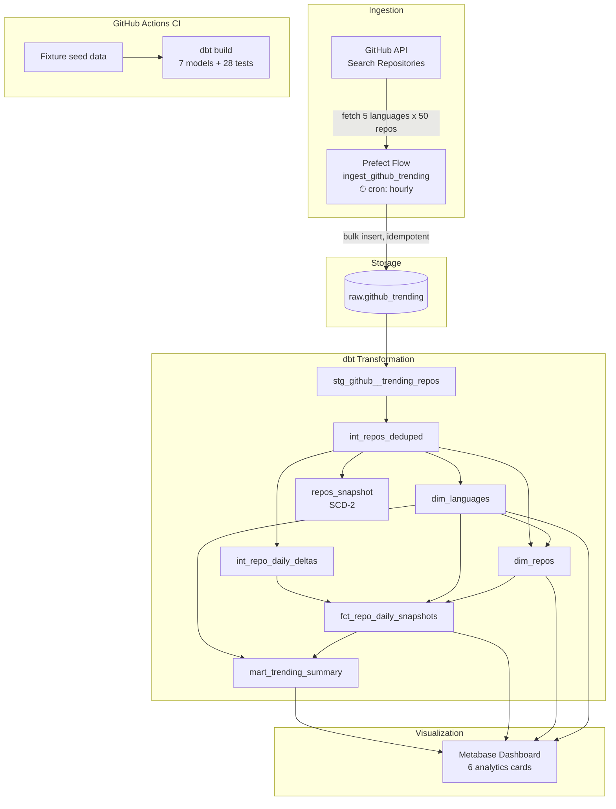

# Architecture Diagram

```mermaid
graph TD
    subgraph Ingestion
        GH[GitHub API<br/>Search Repositories]
        PF[Prefect Flow<br/>ingest_github_trending<br/>⏱ cron: hourly]
    end

    subgraph Storage
        RAW[(raw.github_trending)]
    end

    subgraph Transformation [dbt Transformation]
        STG[stg_github__trending_repos]
        DEDUP[int_repos_deduped]
        DELTA[int_repo_daily_deltas]
        DL[dim_languages]
        DR[dim_repos]
        FCT[fct_repo_daily_snapshots]
        MART[mart_trending_summary]
        SNAP[repos_snapshot<br/>SCD-2]
    end

    subgraph Visualization
        MB[Metabase Dashboard<br/>6 analytics cards]
    end

    subgraph CI [GitHub Actions CI]
        SEED[Fixture seed data]
        BUILD[dbt build<br/>7 models + 28 tests]
    end

    GH -->|fetch 5 languages x 50 repos| PF
    PF -->|bulk insert, idempotent| RAW
    RAW --> STG
    STG --> DEDUP
    DEDUP --> DELTA
    DEDUP --> DL
    DEDUP --> DR
    DEDUP --> SNAP
    DELTA --> FCT
    DL --> DR
    DL --> FCT
    DL --> MART
    DR --> FCT
    FCT --> MART
    MART --> MB
    FCT --> MB
    DR --> MB
    DL --> MB

    SEED --> BUILD
```
